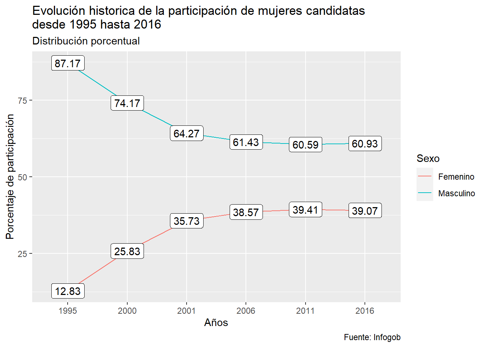
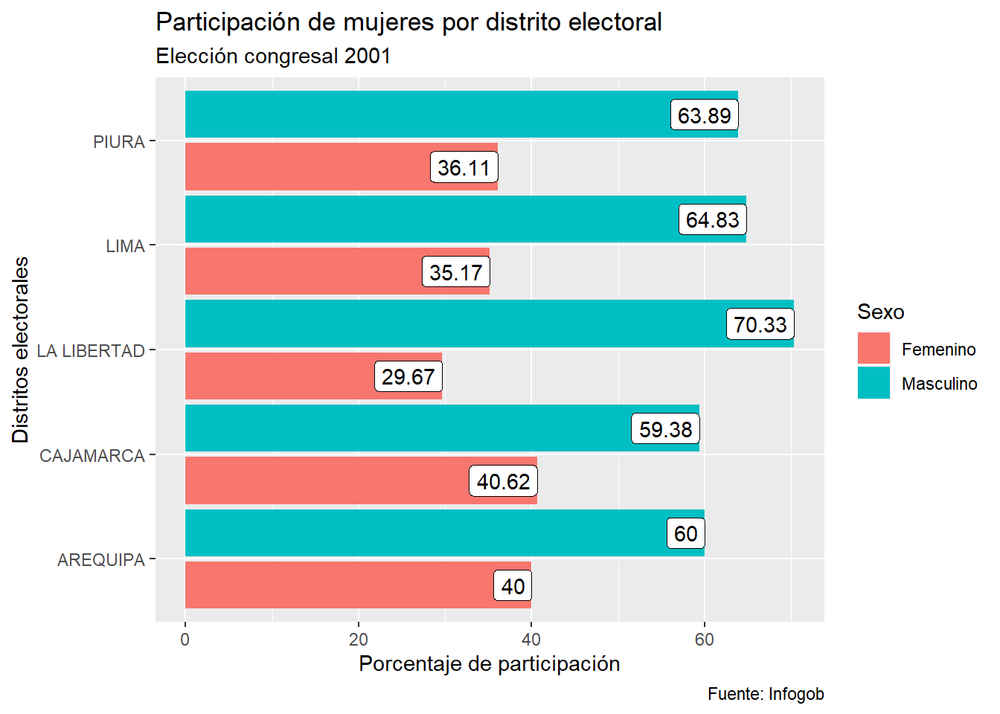
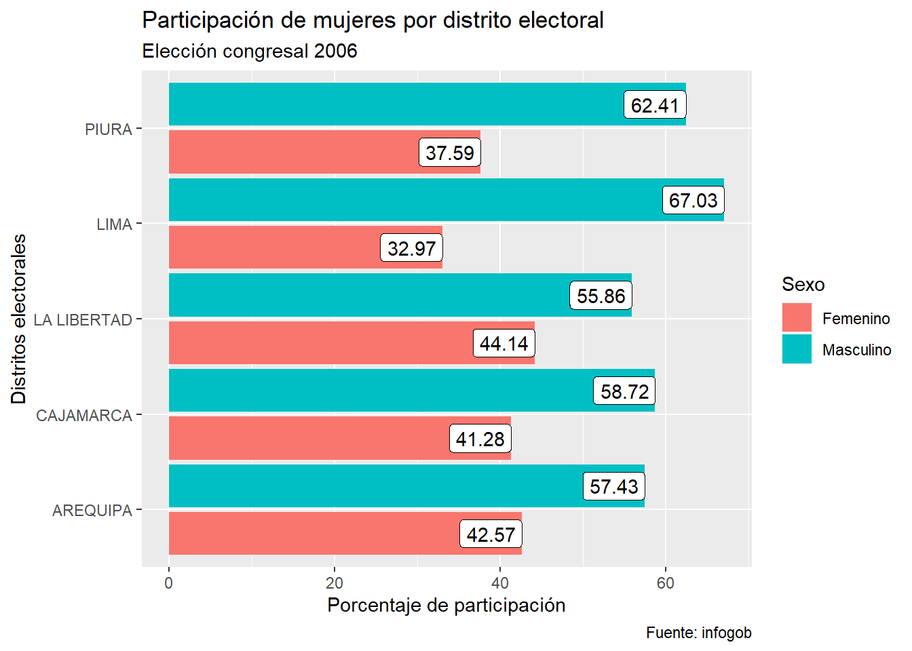
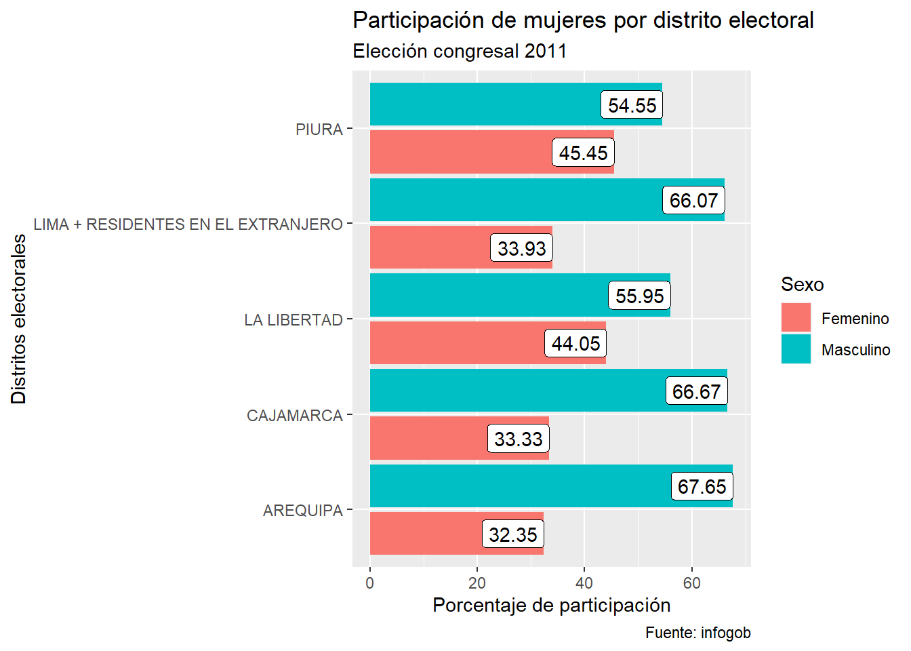
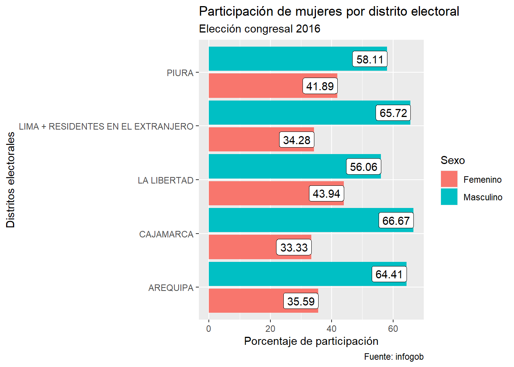
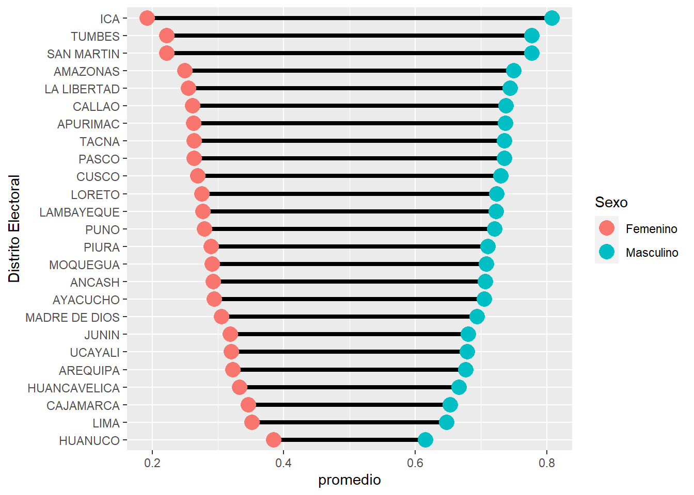
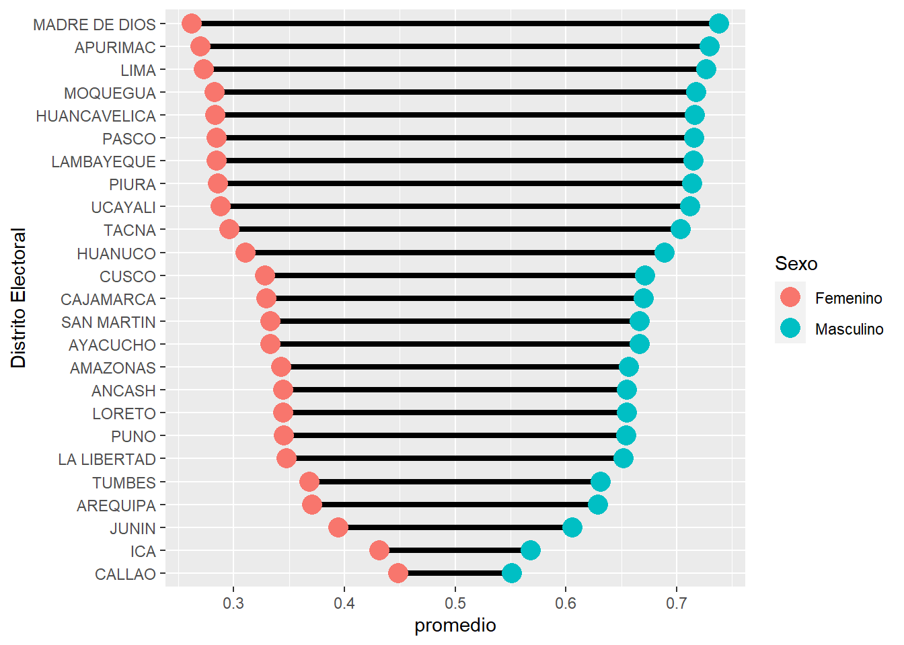
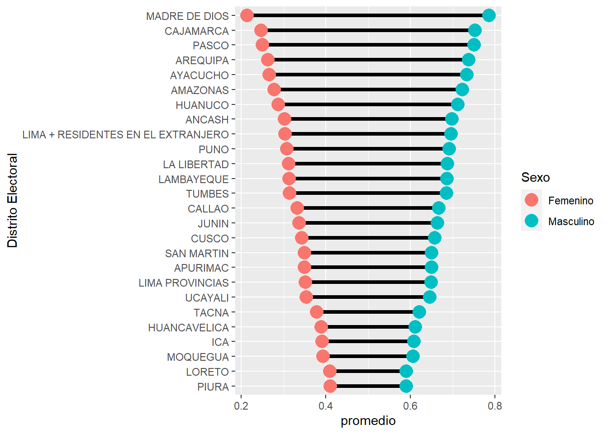
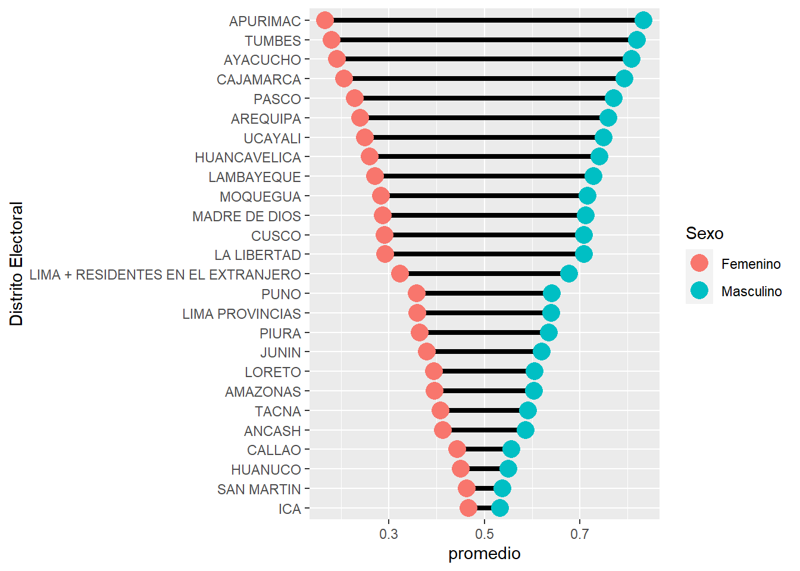
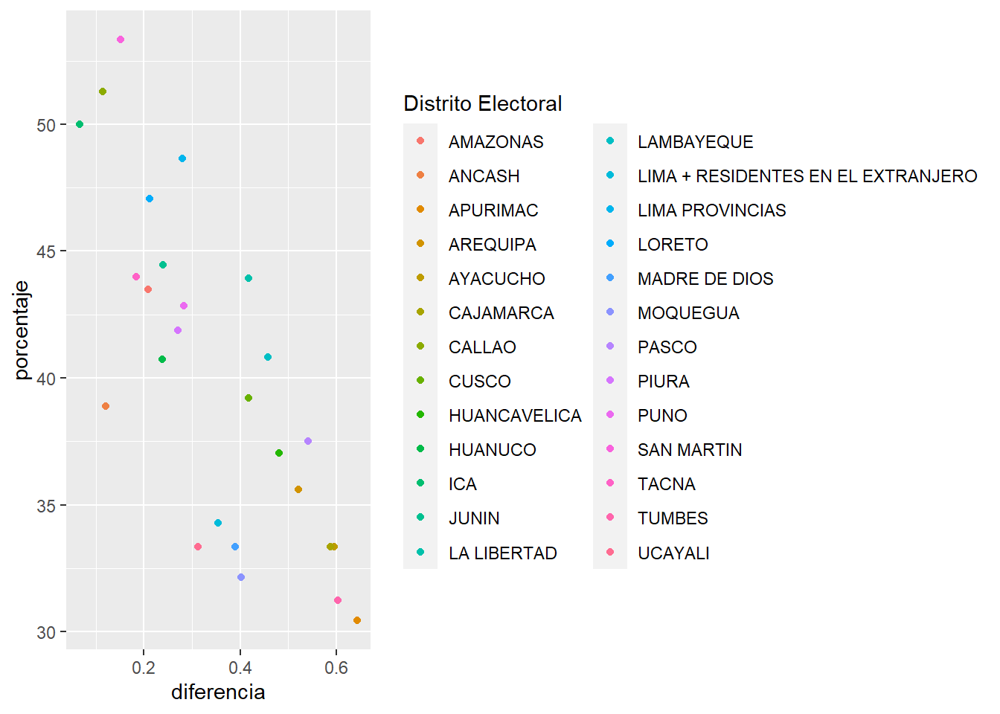

# ¿La política es ancha y ajena?: Participación política de la mujer en elecciones congresales {#participacion-mujeres}

*Christian Reyes Aquino*

## Introducción

Históricamente la representación política estuvo enmarcada por la elección de representantes mediante el voto ciudadano. No obstante, los procesos que anteceden tienen características dignas de analizar debido a las posibles disputas internas que pueden existir. Por ende, este trabajo pretende responder la siguiente pregúnta ¿Cómo ha variado la participación de las mujeres en las listas congresales desde las elecciones del 2001 hasta 2016?.
En esta ocasión, la directriz del análisis iniciará, en primera instancia, del cruce entre las siguientes variables: sexo, organización política y distrito electoral; a fin de mostrar los niveles de participación en cada elección, y en segunda instancia, evidenciar las brechas por sexo durante los procesos elecorales mencionados.

## Paquetes usados

Para la elaboración de este ensayo se utilizaron los siguientes paquetes: 
Tidyverse: Conjunto de paquetes que permitirán importar, transformar, visualizar y modelar la información analizada.
Readxl: Paquete que permite importar la información de formato Excel a R.
Estos paquetes permitirán: manipular, importar, explorar y representar gráficamente el análisis que se pretende mostrar.


```r
library(tidyverse)
library(readxl)
```

## Conjuntos de datos usados

La fuente de los datos utilizados fue extraída del portal institucional infogob.pe. Particularmente se extrajo información concerniente a las(os) candidatos en las elecciones congresales del año 1995, 2000, 2001, 2006, 2011 y 2016; y los resultados de las elecciones congresales para la elección 2016, del cual se extraerá el número de electores por distrito electoral.


```r
autoridades1995 <- read_excel("data/EG1995_Candidatos_Congresal.xlsx")
autoridades1995 <- autoridades1995 %>% select(-c(Cargo))
autoridades1995 <- autoridades1995 %>% mutate(Año_eleccion = "1995")

autoridades2000 <- read_excel("data/EG2000_Candidatos_Congresal.xlsx")
autoridades2000 <- autoridades2000 %>% select(-c(Cargo))
autoridades2000 <- autoridades2000 %>% mutate(Año_eleccion = "2000")

autoridades2001 <- read_excel("data/EG2001_Candidatos_Congresal.xlsx")
autoridades2001 <- autoridades2001 %>% select(-c(Cargo))
autoridades2001 <- autoridades2001 %>% mutate(Año_eleccion = "2001")

autoridades2006 <- read_excel("data/EG2006_Candidatos_Congresal.xlsx")
autoridades2006 <- autoridades2006 %>% select(-c(Cargo))
autoridades2006 <- autoridades2006 %>% mutate(Año_eleccion = "2006")

autoridades2011 <- read_excel("data/EG2011_Candidatos_Congresal.xlsx")
autoridades2011 <- autoridades2011 %>% select(-c(Cargo))
autoridades2011 <- autoridades2011 %>% mutate(Año_eleccion = "2011")

autoridades2016 <- read_excel("data/EG2016_Candidatos_Congresal.xlsx")
autoridades2016 <- autoridades2016 %>% select(-c(Cargo))
autoridades2016 <- autoridades2016 %>% mutate(Año_eleccion = "2016")

Candidatos_congresales <-
  bind_rows(
    autoridades1995,
    autoridades2000,
    autoridades2001,
    autoridades2006,
    autoridades2011,
    autoridades2016
  )

resultados2016 <- read_excel("data/EG2016_Resultados_Congresal.xlsx")
resultados2016 <- resultados2016 %>% select("Distrito electoral", Electores)
```

Por otro lado, los códigos utilizados se pueden dividir en Cuatro secciones:

### Evolución historica de la participación de las mujeres en las listas congresales desde 1995 hasta 2016.

Los resultdos de esta primera sección se obtuvieron mediante el conteo de los candidatos por año y sexo, para luego ser agrupados estrictamento por año de elección y obtener el porcentaje deseado por periodo electoral.


```r
historico <- Candidatos_congresales %>%
  count(Año_eleccion, Sexo) %>%
  group_by(Año_eleccion) %>%
  mutate(porcentaje = n / sum(n) * 100) %>%
  mutate(porcentajes = round(porcentaje,2))
```


### Evolución de la participación de las mujeres en listas congresales por distrito electoral

Para lograr el porcentaje de candidatos hombres y mujeres se realizó mediante el recuento de todos los candidatos divididos por sexo, estos luego pasan son agrupados por distrito elecoral en general. Es así que mediante el conteo general se obtiene el porcentaje de candidatos hombres y mujeres que forman parte de las listas elecorales para luego seleccionar los distritos de Lima, La Libertad, Piura, Arequipa, Cajamarca en los periodos 2001, 2006, 2011 y 2016. 

Elección 2001


```r
participación2001 <- Candidatos_congresales %>%
  filter(Año_eleccion == "2001") %>%
  count(`Distrito Electoral`, Sexo) %>%
  group_by(`Distrito Electoral`) %>%
  mutate(porcentaje = n / sum(n) * 100) %>%
  mutate(porcentajes = round(porcentaje,2)) %>%
  ungroup() %>%
  filter(
    `Distrito Electoral` %in% c("LIMA", "LA LIBERTAD", "PIURA" ,"AREQUIPA", "CAJAMARCA")
  )
```

Elección 2006


```r
participación2006 <- Candidatos_congresales %>%
  filter(Año_eleccion == "2006") %>%
  count(`Distrito Electoral`, Sexo) %>%
  group_by(`Distrito Electoral`) %>%
  mutate(porcentaje = n / sum(n) * 100) %>%
  mutate(porcentajes = round(porcentaje,2)) %>%
  ungroup() %>%
  filter(
    `Distrito Electoral` %in% c("LIMA", "LA LIBERTAD", "PIURA" ,"AREQUIPA", "CAJAMARCA")
  ) 
```

Elección 2011


```r
participación2011 <- Candidatos_congresales %>%
  filter(Año_eleccion == "2011") %>%
  count(`Distrito Electoral`, Sexo) %>%
  group_by(`Distrito Electoral`) %>%
  mutate(porcentaje = n / sum(n) * 100) %>%
  mutate(porcentajes = round(porcentaje,2)) %>%
  ungroup() %>%
  filter(
    `Distrito Electoral` %in% c("LIMA + RESIDENTES EN EL EXTRANJERO", "LA LIBERTAD", "PIURA" ,"AREQUIPA", "CAJAMARCA")
  ) 
```

Elección 2016


```r
participación2016 <- Candidatos_congresales %>%
  filter(Año_eleccion == "2016") %>%
  count(`Distrito Electoral`, Sexo) %>%
  group_by(`Distrito Electoral`) %>%
  mutate(porcentaje = n / sum(n) * 100) %>%
  mutate(porcentajes = round(porcentaje,2)) %>%
  ungroup() %>%
  filter(
    `Distrito Electoral` %in% c("LIMA + RESIDENTES EN EL EXTRANJERO", "LA LIBERTAD", "PIURA" ,"AREQUIPA", "CAJAMARCA")
  ) 
```


### Brechas en la participación de las mujeres en las listas congresales

En esta tercera sección los resultados se obtuvieron mediante la asignación de puntajes según el orden de ubicación tanto de hombres como de mujeres en las listas electorales. Este puntaje permitió determinar el porcentaje de participación de acuerdo a la puntuación obtenida para luego extraer la diferencia entre el porcentaje de hombre y mujeres. Esta operación se realizó para cada periodo electoral (2001, 2006, 2011 y 2016).

Elección 2001


```r
brechas2001 <- Candidatos_congresales %>%
  filter(Año_eleccion == "2001") %>%
  mutate(Sexo = as_factor(Sexo),
         Sexo = fct_rev(Sexo)) %>%
  group_by(`Distrito Electoral`, `Organización Política`) %>%
  mutate(puntaje = (max(`N°`) + 1) - `N°`) %>%
  ungroup()%>%
  group_by(`Distrito Electoral`,`Organización Política`,Sexo, .drop = FALSE)%>%
  summarise(sum_puntaje= sum(puntaje)) %>% 
  mutate(proporcion = sum_puntaje/sum(sum_puntaje)) %>% 
  ungroup() %>% 
  group_by(`Distrito Electoral`, Sexo, .drop = FALSE) %>% 
  summarise(promedio = mean(proporcion)) %>% 
  mutate(diferencia = diff(promedio)) %>% 
  ungroup() %>% 
  mutate(`Distrito Electoral` = fct_reorder(`Distrito Electoral`, diferencia))
```

Elección 2006


```r
brechas2006 <- Candidatos_congresales %>%
  filter(Año_eleccion == "2006") %>%
  mutate(Sexo = as_factor(Sexo),
         Sexo = fct_rev(Sexo)) %>%
  group_by(`Distrito Electoral`, `Organización Política`) %>%
  mutate(puntaje = (max(`N°`) + 1) - `N°`) %>%
  ungroup()%>%
  group_by(`Distrito Electoral`,`Organización Política`,Sexo, .drop = FALSE)%>%
  summarise(sum_puntaje= sum(puntaje)) %>% 
  mutate(proporcion = sum_puntaje/sum(sum_puntaje)) %>% 
  ungroup() %>% 
  group_by(`Distrito Electoral`, Sexo, .drop = FALSE) %>% 
  summarise(promedio = mean(proporcion)) %>% 
  mutate(diferencia = diff(promedio)) %>% 
  ungroup() %>% 
  mutate(`Distrito Electoral` = fct_reorder(`Distrito Electoral`, diferencia))
```

Elección 2011


```r
brechas2011 <- Candidatos_congresales %>%
  filter(Año_eleccion == "2011") %>%
  mutate(Sexo = as_factor(Sexo),
         Sexo = fct_rev(Sexo)) %>%
  group_by(`Distrito Electoral`, `Organización Política`) %>%
  mutate(puntaje = (max(`N°`) + 1) - `N°`) %>%
  ungroup()%>%
  group_by(`Distrito Electoral`,`Organización Política`,Sexo, .drop = FALSE)%>%
  summarise(sum_puntaje= sum(puntaje)) %>% 
  mutate(proporcion = sum_puntaje/sum(sum_puntaje)) %>% 
  ungroup() %>% 
  group_by(`Distrito Electoral`, Sexo, .drop = FALSE) %>% 
  summarise(promedio = mean(proporcion)) %>% 
  mutate(diferencia = diff(promedio)) %>% 
  ungroup() %>% 
  mutate(`Distrito Electoral` = fct_reorder(`Distrito Electoral`, diferencia))
```

Elección 2016


```r
brechas2016 <- Candidatos_congresales %>%
  filter(Año_eleccion == "2016") %>%
  mutate(Sexo = as_factor(Sexo)) %>%
  group_by(`Distrito Electoral`, `Organización Política`) %>%
  mutate(puntaje = (max(`N°`) + 1) - `N°`) %>%
  ungroup()%>%
  group_by(`Distrito Electoral`,`Organización Política`,Sexo, .drop = FALSE)%>%
  summarise(sum_puntaje= sum(puntaje)) %>% 
  mutate(proporcion = sum_puntaje/sum(sum_puntaje)) %>% 
  ungroup() %>% 
  group_by(`Distrito Electoral`, Sexo, .drop = FALSE) %>% 
  summarise(promedio = mean(proporcion)) %>% 
  mutate(diferencia = diff(promedio)) %>% 
  ungroup() %>% 
  mutate(`Distrito Electoral` = fct_reorder(`Distrito Electoral`, diferencia))
```


### Comparación temporal del porcentaje  de mujeres en los primeros lugares de las listas de candidatos congresales

Para esta sección, los resultados obtenidos fueron los porcentajes de mujeres que participaron en cada proceso electoral (2001, 2006, 2011 y 2016).


```r
porcentaje_listas <- Candidatos_congresales %>%
  count(`Distrito Electoral`, Sexo, Año_eleccion) %>%
  group_by(`Distrito Electoral`, Año_eleccion) %>%
  mutate(porcentaje = n / sum(n) * 100) %>%
  mutate(porcentajes = round(porcentaje)) %>%
  ungroup()%>%
  filter(Sexo =='Femenino')
```

En esta segunda parte se obtuvo la diferencia entre el porcentaje de mujeres que participó en cada proceso electoral respecto al porcentaje de hombres.


```r
brechas_listas <- Candidatos_congresales %>%
  mutate(Sexo = as_factor(Sexo),
         Sexo = fct_rev(Sexo)) %>%
  group_by(`Distrito Electoral`, `Organización Política`, Año_eleccion) %>%
  mutate(puntaje = (max(`N°`) + 1) - `N°`) %>%
  ungroup()%>%
  group_by(`Distrito Electoral`,`Organización Política`,Año_eleccion, Sexo)%>%
  summarise(sum_puntaje= sum(puntaje)) %>% 
  mutate(proporcion = sum_puntaje/sum(sum_puntaje)) %>% 
  ungroup() %>% 
  group_by(`Distrito Electoral`, Año_eleccion, Sexo) %>% 
  summarise(promedio = mean(proporcion)) %>% 
  mutate(diferencia = diff(promedio)) %>% 
  ungroup() %>% 
  mutate(`Distrito Electoral` = fct_reorder(`Distrito Electoral`, diferencia))%>% 
  filter(Sexo == 'Femenino')
```

## Resultados

### Evolución histórica de la participación de mujeres en listas congresales desde 1995 hasta 2016.

Podríamos decir que el congreso se conforma a imagen y semejanza del voto ciudadano, y a su vez la ciudadanía en sí responde a las circunstancias históricas que se viven en determinado momento. Entonces, veremos cómo ha cambiado periodo tras periodo el nivel de participación de mujeres.
Para esta acápite se toma en cuenta información histórica de las elecciones realizadas desde 1995 hasta 2016; ello permititirá apreciar las variaciones ocurridas elección tras elección, graficado de manera porcentual, al número de mujeres que conformaron las listas congresales.


```r

historico %>%
ggplot(aes(Año_eleccion, porcentaje)) +
  geom_line(aes(color = Sexo, group = Sexo))+
  geom_label(aes(label = porcentajes))+
  labs(
    title = "Evolución historica de la participación de mujeres candidatas \ndesde 1995 hasta 2016",
    subtitle = "Distribución porcentual",
    caption = "Fuente: Infogob",
    x = "Años",
    y = "Porcentaje de participación"
  )
```



Con los resultados obtenidos, para la elección celebrada en 1995, el nivel de participación de mujeres era de 12.82%. No obstante, para las elecciones celebradas el 2000 (observando una evolución ascendente) el nivel de representación fue de 25.83%. 
Este cambio denota crecimiento significativo entre un periodo y otro respecto al número de mujeres que participaron en dicho periodo electoral. 
Tomando en cuenta el nivel de crecimiento que hubo desde 1995 hasta 2011 (39.40%), existe un cambio progresivo, tal como se observa. Sin embargo, cabe preguntarse ¿Cómo se da este cambio a nivel de distrito electoral? ¿Cómo se da este cambio a nivel de organizaciones políticas? Pues estas son características importantes a tomar en cuenta en este análisis de referido a la participación política.


### Éxodo de las mujeres en la representación política: Mujeres y distritos electorales

Para esta sección, se tomará en cuenta los 5 distritos electorales con mayor número de electores: Lima, La libertad, Piura, Arequipa, Cajamarca; para el análisis de las elecciones 2011 y 2016 el distrito electoral de lima será Lima + Residentes en el extranjero.
Está muestra permitirá determinar esta muesta serán los resultados obtenidos de la elección congresal 2016. Dicha muestra permitirá  observar de forma segmentada el nivel de participación de las mujeres por distrito electoral. Es así que esta muestra será utilizada para el análisis del nivel de participación en las elecciones del 2001, 2006, 2011 y 2016.

<!-- TODO: Se puede mejorar esto. Si estás escogiendo los cinco más grandes debería quedar claro qué porcentaje del total de electores tiene cada distrito y la suma acumulada de los porcentajes  -->


```r
resultados2016 %>% 
  group_by(`Distrito electoral`) %>% 
  summarise(Electores=max(Electores)) %>% 
  arrange(desc(Electores)) %>% 
  filter(row_number()<=5)
#> # A tibble: 5 x 2
#>   `Distrito electoral` Electores
#>   <chr>                    <dbl>
#> 1 LIMA                   7769473
#> 2 LA LIBERTAD            1292488
#> 3 PIURA                  1266557
#> 4 AREQUIPA               1035654
#> 5 CAJAMARCA              1009775
```


#### Elecciones 2001

En el siguiente gráfico, observaremos la distribución por distritos electorales, tal vez dando inicio a una nueva etapa en la concepción de la idea de participación política de las mujeres.


```r
participación2001 %>%
  ggplot(aes(x = porcentaje , y = `Distrito Electoral`)) +
  geom_col(aes(fill = Sexo), position = position_dodge(1)) +
  geom_label(aes(label = porcentajes, group = Sexo), position = position_dodge(1), hjust = 1) +
  labs(
    title = "Participación de mujeres por distrito electoral",
    subtitle = "Elección congresal 2001",
    caption = "Fuente: Infogob",
    x = "Porcentaje de participación",
    y = "Distritos electorales"
  )
```



Conociendo el promedio porcentual de mujeres participantes en el 2001 (35.73%), la situación en estos distritos electorales es menor al 50%, oscilando entre el 30% y 40%, teniendo por un extremo a La Libertad con 29.67% y al otro extremo Arequipa con 40%. Con estos resultados iniciales podemos evidenciar graficamente una disparidad inferior al 50% de mujeres que forman parte de las listas congresales.

#### Elecciones 2006

En este periodo el promedio de mujeres participantes en listas congresales fue de 38.57%. No obstante, se evidencia un ligero cambio al periodo electoral anterior, como bien se observa en el siguiente gráfico:


```r
participación2006 %>%
  ggplot(aes(x = porcentaje , y = `Distrito Electoral`)) +
  geom_col(aes(fill = Sexo), position = position_dodge(1)) +
  geom_label(aes(label = porcentajes, group = Sexo), position = position_dodge(1), hjust = 1) +
  labs(
    title = "Participación de mujeres por distrito electoral",
    subtitle = "Elección congresal 2006",
    caption = "Fuente: infogob",
    x = "Porcentaje de participación",
    y = "Distritos electorales"
  )
```



Como se aprecia, La Libertad alcanza un 44.14%, obteniendo un incremento significativo comparada a la elección que antecede, caso contratio es Lima, con una ligera reducción, obteniendo un 32.97%.
Para este periodo electoral se logra resaltar incrementos, en terminos generales, para Piura, La Libertad, Cajamarca y Arequipados y en un sentido opuesto se encuentra Lima quien evidencia un retroceso porcentual.


#### Elecciones 2011

Para este periodo el promedio de participación de mujeres fue de 39.41%, el cual denota un ligero crecimiento respecto al año electoral anterior. No obstante, ¿qué cambios habrá a nivel distrito electoral? y ¿Lima será nuevamente el distrito electoral con menor porcentaje de mujeres en listas congresales? Estas interrogantes logran resolverse observando el siguiente gráfico:


```r
participación2011 %>%
  ggplot(aes(x = porcentaje , y = `Distrito Electoral`)) +
  geom_col(aes(fill = Sexo), position = position_dodge(1)) +
  geom_label(aes(label = porcentajes, group = Sexo), position = position_dodge(1), hjust = 1) +
  labs(
    title = "Participación de mujeres por distrito electoral",
    subtitle = "Elección congresal 2011",
    caption = "Fuente: infogob",
    x = "Porcentaje de participación",
    y = "Distritos electorales"
  )
```


Como bien se observa, se producen un cambio drástico en Cajamarca y Arequipa, de tener 41, % y 42, % respectivamente, ahora presentan 33,33% y 32,35%. Por otro lado Piura mantiene una secuencia creciente llegando a presentar 45.45% de mujeres en sus listas congresales superior al promedio general para esta elección (39.41%).

#### Elecciones 2016

El promedio general de participación en el año 2016 fue de 39.06%, el cual denota un ligero retroceso respecto al año electoral anterior. No obstante, veremos el despempeño individual de cada distrito electoral mediante el siguiente gráfico:


```r
participación2016 %>%
  ggplot(aes(x = porcentaje , y = `Distrito Electoral`)) +
  geom_col(aes(fill = Sexo), position = position_dodge(1)) +
  geom_label(aes(label = porcentajes, group = Sexo), position = position_dodge(1), hjust = 1) +
  labs(
    title = "Participación de mujeres por distrito electoral",
    subtitle = "Elección congresal 2016",
    caption = "Fuente: infogob",
    x = "Porcentaje de participación",
    y = "Distritos electorales"
  )
```



Piura y La Libertad se mantienen con porcentajes superiores en comparación a los otros tres distritos electorales, pero tienen una ligera reducción en comparación con la elección anterior. Por otro lado, Lima mantiene una tendencia que oscila entre el 32% y 35%, siendo de las que presenta un nivel porcentual bajo en todas las elecciones analisadas teniendo en cuenta que es el distrito electoral con el mayor número de escaños asignados. 
Estos resultados previos muestran las brechas que se evidencian en las ultimas elecciones congresales respecto a cual equitativas son listas en relación al nivel de participación de las mujeres en listas que aspiran a ocupar un cargo de representación nacional.


### Brechas en el nivel de participación de mujeres en listas congresales

Esta sección abordará el grado de diferencia que existe entre el porcentaje de mujeres en relación al percentje de hombres, obteniendo así la diferencia que existe entre un grupo respecto al otro.
Este porcentaje se obtiene a partir de otorgar puntaje a cada candidato según el orden de la lista. Es decir, el candidato número 1 tendrá un puntaje igual al número de candidatos, por ejemplo. si de una lista de 5 candidatos, el candidato que encabeza la lista tendrá 5 puntoy y el según 4 y así sucesivamente. Por consiguiente, el porcentaje de hombres y mujeres estará representado por el puntaje obtenido según de acuerdo a la ubicación de hombres y mujeres, a fin de analizar a profundidad las posibles disparidades que existen al momento de asignar el número de cada candidato.

Para este apartado se toma todos los distritos electorales, a fin de obtener un panorama mucho más amplio y así poder graficar las brechas existentes sobre el nivel de participación de mujeres en las listas congresales de las elecciones 2001, 2006, 2011 y 2016.

Estos resultados pueden llegar a enriquecer el análisis previo, ya que en las secciones anteriores se analizó el porcentaje de mujeres y hombres a partir del conteo por sexo.

#### Elecciones 2001

Este año de elección muestra una distribución significativamente diferente al analisis de porcentaje por conteo previo. ya que Lima quien mantenía un porcentaje que oscilaba entre 30% y 35%, en este análisis de brechas se evidencia una diferencia casi opuesta, ya que de acuerdo a los puntajes asignados la brecha es de 29.56%, estando entre los distritos con menor brecha porcentual. Caso contrario es La Libertad quien poseía un porcentje relativamente cerca al 45% de mujeres en el análisis previo, en este análisis de brechas tiene una diferencia de 48.90%.


```r
brechas2001  %>%
  ggplot(aes(promedio, `Distrito Electoral`)) +
  geom_line(aes(group = `Distrito Electoral`), size = 1.5, linetype = 1) +
  geom_point(aes(color = Sexo), size = 5)
```



#### Elecciones 2006

Este año de elección resulta significativamente distinta al año de elección anterior, pues Lima pasa de un una brecha de 29.56% a una brecha de 45.36% situandose penúltima en el gráfico de brechas. Entre los distritos electorales con menor brecha se encuentra Callao (12.67%) e Ica (13.63%).


```r
brechas2006  %>%
  ggplot(aes(promedio, `Distrito Electoral`)) +
  geom_line(aes(group = `Distrito Electoral`), size = 1.5, linetype = 1) +
  geom_point(aes(color = Sexo), size = 5)
```



#### Elecciones 2011

En comparación con el año de elección anterior, Lima reduce ligeramente su brecha de 45.36% a 39.20%. No obstante se observa a Piura con una brecha de 17.95%, teniendo en cuenta que para el año de elección anterior tenia un 42.85%. 

Hasta este periodo de análisis podemos apreciar que una ligera reducción de extremos entre el 2001 (61.53%) y el 2006 (46.84%), para luego tener un incremento en el 2011 de 53.57%. En el siguiente año de elección veremos como se da el comportamiento de extremos.


```r
brechas2011  %>%
  ggplot(aes(promedio, `Distrito Electoral`)) +
  geom_line(aes(group = `Distrito Electoral`), size = 1.5, linetype = 1) +
  geom_point(aes(color = Sexo), size = 5)
```



#### Elecciones 2016

Teniendo en cuenta Lima como el distrito electoral con mayor número de electores, por ende una asignación mayor de escaños podemos evidenciar una tendencia dispareja pues de un 29.56% (2001) pasa a un 45.36% (2006), luego inicia una tendencia a reducir su brecha pues pasa a 39.20% (2011) y un 35.39% en este periodo de análisis. 

No obstente, para el análisis de riesgos podemos evidenciar una tendencia de ampliación de brechas, pues de una reducción en el 2006 a 46.84% se incrementó a un 53.57% en el 2011 y para el 2016 evidenciamos una brecha de 64.28%, brecha superior al 2001 (61.53%).


```r
brechas2016  %>%
  ggplot(aes(promedio, `Distrito Electoral`)) +
  geom_line(aes(group = `Distrito Electoral`), size = 1.5, linetype = 1) +
  geom_point(aes(color = Sexo), size = 5)
```



Este análisis determina las grandes brechas que existen respecto a la participación real de las mujeres en las listas para elecciones congresales, pues durante los años de muestreo se evidencia un tendencia de ensanchamiento de extremos, pero a la par existe una ligera tendencia de reducción en unos de los distritos con mayor número de escaños (Lima). 

### Relación entre brechas de participación y ubicación de mujeres en listas electorales

A partir de los dos análisis previos, podemos responder nuestra pregúnta inicial: ¿Cómo ha variado la participación de las mujeres en las listas congresales desde las elecciones del 2001 hasta 2016? Pues con los datos resultantes podemos decir que la variación de relación inversa, pues mientras se evidencian tendencias a reducir brechas en algunos distritos elecotrales, el polo extremo tiene una tendencia al aumento. 

El siguiente gráfico tomará analizará la relación entre las brechas y el porcentaje de participación (de acuerdo al puntaje por posición):


```r
porcentaje_listas %>% 
  left_join(brechas_listas) %>% 
  filter(Año_eleccion == '2016') %>%
  ggplot(aes(diferencia, porcentaje, color = `Distrito Electoral`))+
  geom_point() 
```



Este gráfico nos muestra la relación directa que existe ente una reducción de brechas con un mayor porcentaje de mujeres que participan una lista de candidatos, Pues San Martin quien se sitúa en el extremo superior izquierdo tiene un  53.33% de mujeres en lista congresal y una brecha de 15.17%, mientras que Apurimac, que se situa en el extremo inferior derecho, tiene un 30.43% de mujeres y una brecha de 64.28%.

## La idea y la realidad: Reflexiones finales

Recordemos el título de este trabajo "¿La política es ancha y ajena?". La historia nos muestra que sí, periodo tas periodo ha sido una lucha por ir ganando terreno en materia de representación.Si bien, cada ciudadano y ciudadana ejerce su decisión mediante el voto, el abanico de opciones ha sido predominantemente masculino.  
Este trabajo nos abre una serie de interrogantes dignos de análisis, pues ¿qué pasa en el caso de regidores y regidoras, candidatos y candidatas a una alcandía, candidatos y candidatas a un gobierno regional? ¿Cómo se componen las cúpulas de toma de decisión de las organizaciones políticas? ¿Estamos acercándonos a una verdadera representación mas equitativa e igualitaria, con las mismas oportunidades o todo lo contratio?, ¿La idea se hará realidad o seguirá en el imaginario soñador de una representación más equitativa?

Todas estas interrogantes son dignas de analisis para evidenciar la evolución de la representación en su etapa previa, la conformación de listas. Los análisis realizados han evidenciado una tendencia de ensanchamiento de brechas en su polo opouesto, pero tambien ligeras tendencia a reducir las mismas. Es así que el último gráfico muestra que no basta con la inclusión de mujeres en las listas, porque puede que se situen en los últimos lugares, es necesario una distribución equittiva.
